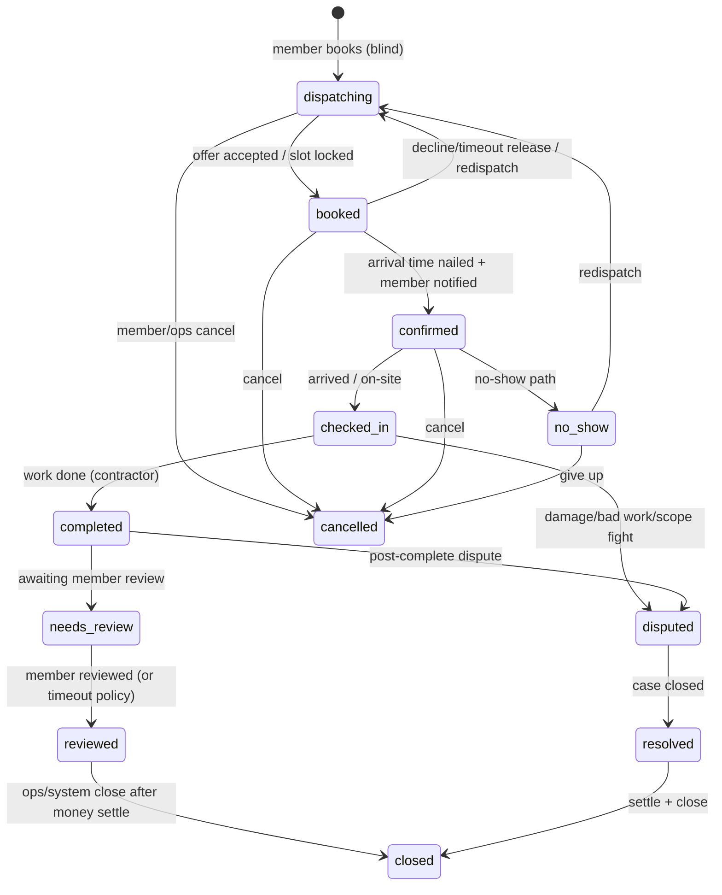

# Strech dispatch — end-to-end flow plan

Trackable plan for the full job lifecycle. Aligns the product “four flows” with Strech domain vocabulary and invariants in `AGENTS.md`.

**Done test (phase):** console watches real data through  
`dispatching → booked → confirmed → checked_in → completed → needs_review → reviewed → closed`  
(plus money rows + messy-path cases). Member app / SMS / payments processors are stubbed behind `/v1` where needed.

---

## 0. One job, one spine



**Money is not on this diagram.** `charge` / `refund` / `payout` rows join by `service_request_id`. A job can be `completed` and later `refunded` without changing status to “paid/refunded”.

### Actors on every transition

| Actor | Owns |
|-------|------|
| **member** | create request, see masked status, confirm completion, review, dispute |
| **agent** | score pool, fan-out offers, lock/release, propose arrival, parse field SMS, reminder scheduling, escalate — **only allow-listed APIs** |
| **contractor** | accept/decline offer, set/confirm arrival, otw/arrived/done, on-site exceptions |
| **ops** | exhaust-pool takeover, vetting, money auth, legal/medical/employment, ambiguous escalations |
| **system** | timers (offer TTL, reminders, review nudge), idempotent workers |

Every status change → `job_event` (audit + member timeline).

---

## 1. Flow A — Book → Dispatch

**Product intent:** Member books service type + address + window. Agent ranks vetted pool, fans out SMS offers (sequential TTL or small parallel first-accept-wins). Accept locks job; decline/timeout releases; pool exhaust → ops.

### A1. Intake (stub member app → `/v1`)

| Step | Who | API / artifact | Notes |
|------|-----|----------------|-------|
| A1.1 Create service request | member | `POST /v1/requests` | category, property, preferred window, details |
| A1.2 Land in pool | system | status `dispatching` | `job_event`; promise_by SLA clock starts |
| A1.3 INV-2 mask | API | member GET never exposes contractor | even while offers are out |

**Trackable acceptance:** request appears in ops Pool; member view shows “finding a pro” only.

### A2. Candidate scoring (agent, low-risk)

Score **vetted-only** contractors on:

1. **Skill match** — category ∩ contractor.categories  
2. **Distance / service zip** — property.zip ∈ service_zips (later: travel time)  
3. **Current load** — open booked/confirmed/checked_in count in window  
4. **Historical accept rate** — accepts / offers (rolling)  
5. (Optional later) rating, metro capacity, membership priority  

Output: ranked candidate list + recommended offer strategy (`sequential` | `parallel_batch`).

**Agent fence:** scoring + creating offers = allow-listed. Changing vetting, suspending pros, touching money = 403 → ops.

### A3. Offer fan-out

| Mode | Behavior |
|------|----------|
| **Sequential** | Offer top-1; TTL (e.g. 5–10m); on decline/timeout → next |
| **Parallel batch** | Offer top-N (e.g. 3); **first accept wins**; others auto-withdraw |

Artifacts (tables — names fixed for code):

- `dispatch_offer` — request_id, contractor_id, rank, status (`pending|accepted|declined|expired|withdrawn`), expires_at, channel (`sms` stub), **`reply_token`**  
- `dispatch_wave` — strategy, batch size, started_at  

**Capacity (H10):** contractors expose concrete `availability_slots` (start/end). Scoring only returns pros with a free slot overlapping the preferred window. Accept books that slot into `appointments` and blocks overlaps (exclusion per contractor).

**Empty pool at intake:** still create `dispatching` + open case `escalation` reason=`no_candidates` (do not fail member book).

SMS is a **notification adapter** stubbed in API (`NotificationPort.sendOffer`). Console Accept/Decline stand-in for phase-1.

### A4. Lock / release / escalate (H10 race)

| Event | Status / data | Who |
|-------|---------------|-----|
| Accept | txn: lock request → fitness check (H18) → appointment → offer `accepted` → siblings `withdrawn` → `booked` | contractor (or agent applying inbound) |
| Decline / TTL | release; continue wave | system / contractor |
| Second accept | `409 OFFER_LOST` (first writer wins) | API |
| Slot taken | `409 SLOT_CONFLICT` → fail this accept, continue wave / escalate | API |
| Pool exhaust | case `escalation` `pool_exhaust`; stay `dispatching`; `dispatch_owner=ops` | system |

**Trackable acceptance:** parallel double-accept → exactly one `booked`; other `OFFER_LOST`; slot exclusion enforced.

---

## 2. Flow B — Dispatch → Confirmed

**Product intent:** After accept, nail exact arrival (not just window), notify member in-app, set reminder cadence T-24h / T-2h / T-30m.

### B1. Arrival solidification

| Step | Who | API act | Notes |
|------|-----|---------|-------|
| B1.1 Propose exact arrival within window | agent or contractor | `propose_arrival` | writes/updates `appointments` provisional → firm |
| B1.2 Contractor acks arrival | contractor | **`ack_arrival`** | required before confirm_visit |
| B1.3 Appointment authoritative | API | | `appointments.slot_start/end` |

### B2. Visit confirmation (blind) — not “member confirm”

| Step | Who | API act | Notes |
|------|-----|---------|-------|
| B2.1 Flip → `confirmed` | agent/ops (policy) | **`confirm_visit`** | only after `ack_arrival` + locked appointment |
| B2.2 Member notification | system | | masked pro label + time + `confirmation_code` |
| B2.3 Create `charge` | system | | status `pending` — see §13 money rules |

### B3. Reminder cadence

| Reminder | Audience | Channel stub |
|----------|----------|--------------|
| T-24h | member + contractor | push/SMS port |
| T-2h | member + contractor | |
| T-30m | member + contractor | |

Store `reminder_job` rows (request_id, fire_at, kind, status). System worker fires them; each fire → `job_event` note.

**Reschedule rule (H16):** any slot change **cancels** all `scheduled` reminders for that request and inserts a fresh cadence from the new `slot_start`. Cancel/no_show also cancels pending reminders (no retraction SMS required in v1; optional later).

**Timezone (H16):** all fire_at computed in **property local TZ** (stored on `properties.timezone`, default from zip→TZ table).

**Trackable acceptance:** `ack_arrival` then `confirm_visit` → `confirmed` + pending charge + reminders; member payload passes INV-2 tests.


---

## 3. Flow C — Confirmed → Job Complete

**Product intent:** Contractor signals otw / arrived / done (SMS or state prompt). Agent parses → timestamps → member progress. Handle messy on-site paths.

### C1. Happy path field signals

Map colloquial SMS → canonical transitions (API enforces; parser is adapter):

| Signal | Canonical | Status |
|--------|-----------|--------|
| `otw` / on my way | `en_route` event (optional substate) | stay `confirmed` + event, **or** soft flag |
| `arrived` | check-in | → `checked_in` |
| `done` | complete | → `completed` |

Prefer **explicit API actions** (`POST .../en-route`, `/check-in`, `/complete`) with SMS parser calling those. Free-text never mutates status except via the allowlisted parser (§13 H11).

### C2. Member progress view (stub)

Member sees timeline from `job_event`s, masked (INV-2):

- Visit confirmed  
- On the way  
- Arrived  
- Work completed  

### C3. Messy paths → **cases** (not ad-hoc flags alone)

| Situation | API / signal | Case? | Behavior |
|-----------|--------------|-------|----------|
| **Running late** | `report_late` + ETA | no (flag+event) unless slip > policy | agent ok under `max_eta_slip_minutes`; else case `escalation` |
| **Can't find place** | `cant_find` | case `escalation` if unresolved 15m | contractor gets `contractor_field` access notes only |
| **Scope changed** | `scope_change` | case **`scope_change`** | agent may open case; **ops only** approves price → amend `charge` |
| **Member not home** | `no_show` party=homeowner | case `no_show` | status → `no_show`; money per §13 cancel/no-show |
| **Needs a part** | `parts_hold` | case `parts_hold` | stay `checked_in`; spawn **linked follow-up** request (§13 H14) |
| **Needs reschedule** | `reschedule` | case `reschedule` if either party disputes | rewrite appointment; rewrite reminders |
| **Contractor no-show** | system timer | case `no_show` | → `no_show` → redispatch; fitness strike |
| **Safety / medical / HHS** | emergency ingress | case **`emergency`** | **never agent** — §13 H9 |

`job_flags` are denormalized hints for UI; **`cases` is the source of truth** for anything ops must own.

**Trackable acceptance:** each messy path opens the right case type or flag; agent 403 on scope price + emergency.


---

## 4. Flow D — Complete → Paid

**Product intent:** Contractor completes → system moves to review → capture money → payout held → member review → close. Money never becomes a job status.

### D1. Completion + review order (H4 + H7) — single machine

```text
checked_in
  → completed          # contractor complete (summary required)
  → needs_review       # automatic on complete (system)
  → reviewed           # member review submitted OR review_timeout (e.g. 72h)
  → closed             # guards below
```

| Act | Who | Name | Effect |
|-----|-----|------|--------|
| Finish work | contractor | `complete` | → `completed` then immediately → `needs_review` |
| Say work was OK | member | **`ack_completion`** | `job_event` only (does **not** skip review); optional signal for payout release policy |
| Star/comment review | member | `submit_review` | → `reviewed` |
| Open fight | member/ops | opens case `dispute` | status → `disputed` (payout hold) |

Member **does not** have a third “confirm” that means visit booking — that is `confirm_visit` in Flow B.

### D2. Money ledger (H5 / H6) — fixed timing

| When | Charge | Capture | Payout |
|------|--------|---------|--------|
| `confirm_visit` | create `charge` `pending` (tier may be `$0`) | — | — |
| ops approves `scope_change` | amend `charge.amount_cents` | — | — |
| `complete` | finalize amount if needed | enqueue capture if amount > 0 | create `payout` `held` |
| capture worker | — | `payment_attempt`; charge → `captured` \| `failed` | — |
| `closed` (no open money-hold case) | must be `captured` or `amount_cents=0` or `voided` | retry failures visible to ops | payout → `payable` (processor stub) |
| case `dispute` / `emergency` open | — | no auto-refund | stay `held` |
| ops refund | new `refund` row; charge may stay `captured` | — | clawback/adjust payout |

**Capture failure:** job can stay `needs_review`/`reviewed`; close **blocked** until ops voids, comps (`amount_cents=0` + note), or capture succeeds. Agent cannot capture/refund.

**Close guards:** no open cases with `blocks_close=true`; charge terminal (`captured`|`voided`|$0); payout not `held` unless explicitly waived by ops.

### D3. Trackable acceptance

Console shows charge created at confirm; payout `held` at complete; review column; close rejected if dispute open or capture failed.


---

## 5. How the agent watches and keeps the loop moving

The agent is **not** a chat prompt with privileges. It is a **worker loop** that reads dispatch state, decides low-risk next actions, and calls the same `/v1` endpoints as ops — under an `role=agent` JWT that the API allow-lists. Timers are **system**; judgment calls are **agent**; hard fences escalate to **ops**.

### 5.1 Split of duties

| Layer | Runs | Owns |
|-------|------|------|
| **system workers** | cron / queue | Offer TTL expiry, reminder fire (T-24/T-2/T-30), no-show clock, review nudge — pure time triggers, no “judgment” |
| **agent runtime** | continuous or tick (e.g. every 15–60s) + event wakeups | Watch pool/board, score, fan-out offers, propose arrival, auto-confirm when policy says so, parse SMS → API, escalate stuck jobs |
| **ops** | human console | Exhausted pool, money, scope price, medical/legal, anything agent policy marks `escalate` |

System fires the clock; agent decides what to do when the clock (or a new event) says “something needs attention.”

### 5.2 Watch model — event + poll

Agent stays current by:

1. **Polling work queues** (API):
   - `GET /v1/agent/work` (or filtered pool/board) → jobs needing attention, grouped by reason  
     Examples: `needs_offer_wave`, `awaiting_arrival_proposal`, `ready_to_confirm`, `stale_confirmed`, `unparsed_inbound_message`, `pool_exhaust`, `sla_breach_soon`
2. **Event wakeups** (preferred when available):
   - New `job_event`, inbound SMS, offer accept/decline, timer fired → enqueue agent tick for that `service_request_id`
3. **Per-job projection**: agent reads request + offers + appointment + recent events + open flags — never invents state the DB doesn’t have

Every agent action still writes `job_event` with `actor_role=agent` so ops can see exactly what the agent did.

### 5.3 Agent confirmation settings (`agent_policy`)

“Running its own confirmation settings” = a **versioned policy row** (not prompt text) the agent loads each tick. Ops can view/edit in console; agent cannot widen its own fence.

```text
agent_policy (example fields)
─────────────────────────────
offer.strategy                 sequential | parallel_batch
offer.batch_size               3
offer.ttl_seconds              600
offer.max_waves_before_ops     3

confirm.auto_confirm           true | false
confirm.require_contractor_ack true          # arrival must be acked
confirm.max_eta_slip_minutes   30            # late ETA auto-ok under this
confirm.reminder_cadence       [24h, 2h, 30m]

field.auto_apply_sms           true          # parser → check-in/complete if unambiguous
field.ambiguous_sms            escalate      # never guess

sla.promise_by_escalate_minutes 30           # before promise_by → ops
stuck.no_progress_minutes      45            # booked/confirmed with no movement

# hard denials are NOT in this file — they live in API allow-list code
```

**Confirmation flow under policy:**

1. Offer accepted → `booked`  
2. Agent proposes exact arrival within window (or contractor sent one)  
3. If `require_contractor_ack` and contractor hasn’t acked → wait / nudge via system reminder  
4. If prerequisites met and `auto_confirm=true` → agent calls `POST /requests/{id}/confirm`  
5. If `auto_confirm=false` or confidence/prereqs fail → leave on ops Board as `ready_to_confirm`  
6. System schedules reminder rows from `reminder_cadence` (agent requests schedule; system fires)

Agent does **not** invent reminder times per chat turn — it applies policy, then system owns delivery.

### 5.4 Keep-moving loop (one tick)

```text
for job in agent_work_queue:
  if medical_or_money_or_legal(job): escalate_ops; continue
  match job.attention_reason:
    needs_offer_wave      → score; create offers per policy
    offer_expired         → next wave or escalate if max_waves
    awaiting_arrival      → propose slot; nudge contractor
    ready_to_confirm      → confirm if policy.auto_confirm else escalate
    inbound_sms           → parse; if unambiguous apply API else escalate
    late_under_threshold  → update ETA + notify member
    late_over_threshold   → escalate ops
    stuck / sla_breach    → escalate ops
    else                  → no-op (system timers still run)
```

If the API returns **403**, agent must escalate — it never retries a denied action with a different story.

### 5.5 What ops sees

- **Agent activity** on the request timeline (`actor_role=agent`)  
- **Policy panel** — current confirmation/offer/SLA settings  
- **Escalation queue** — jobs the agent refused or could not advance  
- Toggle `auto_confirm` off → agent still watches and prepares; humans press Confirm  

---

## 6. Agent fence (API allow-list sketch)

**Allow (low-risk):**

- Read pool / agent work queue, score candidates, create/cancel offers  
- Apply accept/decline from contractor channel  
- Propose arrival time; trigger **`confirm_visit`** when policy + `ack_arrival` allow  
- Request reminder schedule (system fires)  
- Parse field signals into en-route / check-in / complete **via allowlist parser only**  
- Open cases (`escalation`, `parts_hold`, `scope_change` log) — not resolve money  
- Escalate to ops queue  
- Read `agent_policy` (write policy = **ops only**)  

**Deny (403 → human):**

- Vetting approve/suspend, employment decisions  
- Money: capture, refund, payout override, tip disputes, charge amend  
- Scope/price change **approval**  
- Resolve `emergency` / read medical payloads  
- Legal / damage / injury outcomes  
- Blind-booking bypass  
- Widening allow-list or policy  
- Anything ambiguous → deny/escalate  

---

## 7. Console surfaces (thin, trackable)

| Console view | Shows |
|--------------|-------|
| **Pool** | `dispatching` + promise_by + active wave |
| **Offer radar** (new) | pending offers, TTLs, accepts/declines |
| **Agent** (new) | work queue, last tick, policy (`auto_confirm`, offer TTL, SLA), escalations |
| **Board** | columns by status |
| **Request desk** | events timeline, flags, actions, money panel |
| **Reminders** | upcoming T-24/T-2/T-30 |
| **Cases** | disputed / no_show / scope_change needing ops |
| **Field** | contractor jobs + otw/arrived/done buttons (SMS stand-in) |
| **Contractors** | vetting, availability |

---

## 8. Work packages (build order — trackable)

Use these as tickets. Each has a crisp acceptance. Prefer API-first; console follows same package.

### WP0 — Foundations
- [ ] Schema spine: requests, properties, contractors (vetted), appointments, job_events  
- [ ] Actor JWT roles + edge bearer  
- [ ] Status transition engine (central) — illegal transitions 409  
- [ ] Every transition writes `job_event`  
- [ ] INV-2 member serializer tests  

### WP1 — Book → pool
- [ ] `POST /requests` → `dispatching`  
- [ ] Pool list for ops/agent  
- [ ] Console Pool  

### WP2 — Scoring + offers
- [ ] Ranked candidates endpoint (skill, zip, load, accept rate)  
- [ ] `dispatch_offer` + sequential + parallel_batch strategies  
- [ ] Offer TTL worker  
- [ ] Accept → `booked` + slot lock; withdraw siblings  
- [ ] Pool exhaust → ops escalation queue  
- [ ] Console Offer radar + accept/decline stand-in  

### WP3 — Confirm + reminders
- [ ] `ack_arrival` + `confirm_visit` (not overloaded `/confirm`)  
- [ ] Charge `pending` created on `confirm_visit`  
- [ ] Masked member notification stub  
- [ ] Reminder rows + worker; rewrite on reschedule  
- [ ] `agent_policy` + auto `confirm_visit` path  
- [ ] `promise_by` from category×tier SLA  

### WP3b — Agent runtime (watch loop)
- [ ] `GET /v1/agent/work` attention queue (excludes emergency)  
- [ ] Agent tick worker (poll + event wakeup)  
- [ ] Apply policy: offer waves, auto-confirm_visit, escalate stuck/SLA  
- [ ] All agent actions as `job_event` with `actor_role=agent`  
- [ ] Console Agent panel (queue + policy toggles)  
- [ ] 403 on policy self-widen / money / medical  

### WP4 — Field loop
- [ ] en-route / check-in / complete APIs  
- [ ] Field console buttons  
- [ ] SMS `reply_token` + allowlist parser stub  
- [ ] Member timeline projection (redaction tier)  

### WP5 — Messy paths + cases
- [ ] `cases` table + console Cases  
- [ ] late / cant_find / scope_change / no_show / parts_hold + child request  
- [ ] `POST /v1/emergency` ingress + agent bypass  
- [ ] cancel matrix + reminder cancel  
- [ ] agent 403 tests on medical + money + scope approve  

### WP6 — Money + review + close
- [ ] charge @ confirm_visit; capture @ complete; payout held→payable @ close  
- [ ] `needs_review` auto on complete; review timeout 72h  
- [ ] `ack_completion` + `submit_review`  
- [ ] close guards; refund rows  
- [ ] Console money + case panels  

### WP7 — Hardening
- [ ] Idempotency keys on all writes  
- [ ] OFFER_LOST + SLOT_CONFLICT + CONTRACTOR_UNFIT correctness  
- [ ] PII serializer tier tests  
- [ ] Fitness-at-accept tests  
- [ ] Audit export of job_events  
- [ ] Smoke: happy path + messy path + money path + emergency bypass  

---

## 9. Mapping your four flows → WPs

| Product flow | Primary WPs | Happy path statuses |
|--------------|-------------|---------------------|
| Book → Dispatch | WP1, WP2 | → `dispatching` → `booked` |
| Dispatch → Confirmed | WP3 | → `confirmed` |
| Confirmed → Job Complete | WP4, WP5 | → `checked_in` → `completed` |
| Complete → Paid | WP6 | money rows + → `needs_review` → `reviewed` → `closed` |

---

## 10. Explicit non-goals (this phase)

- Real Twilio/Stripe (ports + stubs only)  
- Member consumer app / Bobo 3D UI  
- Full geo routing ML  
- Production IdP  

Stub the ports; keep the state machine and audit trail real.

---

## 11. Suggested next step

Implement **WP0 → WP1 → WP2** until Offer radar can lock a job from the pool in the console. That is the first vertical slice of Flow A and unblocks everything else. Close **H1–H3, H12, H13** before that slice so you don’t rebuild the spine twice.

---

## 12. Holes — unresolved decisions & missing machinery

These are the gaps. Do not paper over them in code; decide or ticket explicitly.

### H1 — Status vocabulary drift (blocking)
Plan uses `booked` / `checked_in`. Legacy console/API smoke used `scheduled` / `assigned` / `in_progress`. **One canonical enum must win** before WP0. Every client and transition table depends on it.

### H2 — When does the appointment row exist?
Accept → `booked` locks a slot, but B1 still “proposes exact arrival.” Unclear whether:
- (a) accept locks a **provisional** window and confirm writes final `appointments` row, or  
- (b) accept already writes `appointments` and confirm only flips status + notifies.  
Race rules (SLOT_CONFLICT, withdraw siblings) differ. **Decide in WP2.**

### H3 — INV-2 after confirmation (policy undecided)
Domain says mask before *and per policy after* confirm. Plan hedges. Need a hard rule:
- member never sees legal name/photo/phone, **or**
- after `confirmed`, member sees limited identity for safety (name + photo + ETA).  
Serializer tests cannot be written until this is fixed.

### H4 — “Confirm” means three different acts
**RESOLVED → §13.** Acts are `ack_arrival`, `confirm_visit`, `ack_completion` (+ `submit_review`).

### H5 — Charge lifecycle timing
**RESOLVED → §13.** Charge at `confirm_visit`; capture on `complete`; close blocked on failure.

### H6 — Payout vs close ordering
**RESOLVED → §13.** Payout `held` at complete → `payable` at close; dispute holds payout.

### H7 — Dual-confirm vs `needs_review` sequence
**RESOLVED → §13.** `complete` → `completed` → auto `needs_review` → `reviewed` → `closed`.

### H8 — Case model is underspecified
**RESOLVED → §13.** Single `cases` table; change-requests and escalations are case types.

### H9 — Emergency / Home Health Score ingress
**RESOLVED → §13.** `POST /v1/emergency` (+ per-request panic); case `emergency`; agent queue bypass.

### H10 — Offer race & capacity truth
**RESOLVED → §13.** Slot rows + txn lock + `OFFER_LOST`/`SLOT_CONFLICT`; empty pool → escalation case.

### H11 — SMS identity & threading
**RESOLVED → §13.** `reply_token` + allowlist parser; else ambiguous escalation.

### H12 — Agent runtime hosting
Where does the tick process live? Inside `strech-dispatch-api` workers? Separate `strech-dispatch-agent` service?  
Who mints `role=agent` JWTs in prod?  
Idempotency if two ticks run on the same job.  
**No repo for dispatch-api in this workspace** — greenfield hole for the source of truth itself.

### H13 — Ops + agent double-driving
Can ops manually book while agent is mid-wave?  
Need lock: `dispatch_owner = agent|ops`, or cancel open offers on ops takeover.  
Otherwise duplicate assigns / SLOT_CONFLICT storms.

### H14 — Follow-up / parts / multi-day work
**RESOLVED → §13.** Child request via `parent_request_id`; direct re-offer same pro.

### H15 — Cancellation & money
**RESOLVED → §13.** Status×who matrix; void pending charge; no cancel after completed (use dispute/refund).

### H16 — Reminder edge cases
**RESOLVED → §13.** Property TZ; cancel+rewrite on reschedule; cancel pending on terminal.

### H17 — Access / elderly / PII in `details`
**RESOLVED → §13.** Tiers: `member_public` / `contractor_field` / `ops_only` / `agent_context`.

### H18 — Contractor fitness over time
**RESOLVED → §13.** Re-check vetting, suspend, insurance expiry at accept txn.

### H19 — SLA `promise_by`
**RESOLVED → §13.** `created_at + sla_hours(category, tier)`; breach → escalation case only.

### H20 — Console “done test” vs product four flows
Done test is desk-driven loop. Product flows assume agent + SMS + card capture.  
Without stubs that **look real in console** (offer accept, fake SMS inbound, fake payment_attempt), holes H5/H11 stay invisible until late.

### H21 — Legacy console mismatch
Current `strech-ops-console` has no Offer radar, Agent panel, money panel, cases, or `booked`/`checked_in` gates. Rebuild vs patch is undecided under “start fresh.”

### Priority to close first (before coding past WP2)
1. **H1** status enum  
2. **H2** appointment timing  
3. **H3** INV-2 post-confirm  
4. **H13** ops vs agent ownership  
5. **H12** where dispatch-api + agent worker live  

**Resolved this pass:** H4–H11, H14–H19 → see **§13**.

---

## 13. Hole fixes — locked decisions (H4–H11, H14–H19)

### H4 — Three acts, three names (never call them all “confirm”)

| Act | Endpoint (canonical) | Who | When |
|-----|----------------------|-----|------|
| **`ack_arrival`** | `POST /requests/{id}/ack-arrival` | contractor | after proposed slot; required before visit confirm |
| **`confirm_visit`** | `POST /requests/{id}/confirm-visit` | agent/ops | → `confirmed`; creates pending `charge`; schedules reminders |
| **`ack_completion`** | `POST /requests/{id}/ack-completion` | member | after `completed`; timeline event only |
| **`submit_review`** | `POST /requests/{id}/review` | member | → `reviewed` |

Deprecate overloaded `/confirm` in new code; alias only if legacy smoke needs it.

### H5 / H6 / H7 — Money + review order

**Review machine (only one):**  
`complete` → `completed` → *(system)* → `needs_review` → `reviewed` (member review or 72h timeout) → `closed`

**Money timing:**

1. **`confirm_visit`** → insert `charge` (`pending`, amount from category + membership tier; included visit = `0`)  
2. **Ops approves scope_change case** → amend charge amount  
3. **`complete`** → finalize charge; create `payout` (`held`); enqueue capture if amount > 0  
4. **Capture worker** → `payment_attempt`; charge `captured` or `failed` (retry w/ backoff; surface on Cases)  
5. **`closed`** allowed iff: no `blocks_close` cases AND charge in (`captured`|`voided`) or amount 0 AND payout moved `held` → `payable` (or ops waiver)  
6. **Dispute/emergency open** → payout stays `held`; refunds are separate `refund` rows (status unchanged)

### H8 — Single `cases` model

```text
cases
  id, service_request_id, type, status (open|resolved|dismissed),
  reason_code, owner_role (ops|system), blocks_close bool,
  money_impact (none|amend_charge|refund|hold_payout),
  created_at, resolved_at, meta jsonb
```

**Types:** `escalation` | `scope_change` | `reschedule` | `no_show` | `parts_hold` | `dispute` | `emergency` | `cancel_request`

- Legacy “change-request” = case `scope_change` or `reschedule`  
- Escalation queue = `cases` where `type=escalation` and `status=open`  
- `job_flags` = optional cache for UI; opening/resolving a case syncs flags  
- Status `disputed` / `resolved` on the request are for dispute/emergency arcs; other cases may not change primary status

### H9 — Emergency / HHS ingress

| Ingress | Path |
|---------|------|
| Sensor / HHS service | `POST /v1/emergency` with `property_id` or `homeowner_id` + `signal_type` + `payload` (system HMAC) |
| Ops panic | same endpoint as `role=ops` |
| Contractor “member in danger” | `POST /requests/{id}/emergency` → same case pipeline |

**Behavior:** create case `emergency` (`blocks_close=true`, `money_impact=hold_payout`); set request flag; **remove from agent work queue**; page ops; write `job_event`. Agent calling emergency APIs except “create via contractor panic” read path → 403 on resolve/money. Medical payload never included in agent prompt/context serializers.

### H10 — First-accept + slots

- Availability = concrete `availability_slots`  
- Accept runs in a DB transaction with `SELECT … FOR UPDATE` on `service_requests`  
- Partial unique index: one `accepted` offer per request  
- Exclusion constraint / overlap check on `appointments(contractor_id, slot_start, slot_end)`  
- Conflicts: `OFFER_LOST` | `SLOT_CONFLICT` | `CONTRACTOR_UNFIT` — never silent  

### H11 — SMS threading + unambiguous parser

**Outbound:** every offer/field prompt SMS includes `reply_token` (short code, e.g. `AB7K`) + maps to `(contractor_id, service_request_id, purpose)`.

**Inbound resolution order:**
1. Token in message body → exact job  
2. Else contractor’s single active context (one pending offer OR one job in `confirmed|checked_in`)  
3. Else → case `escalation` `ambiguous_sms` (do not mutate)

**Unambiguous parser (v1 = allowlist only, no LLM status writes):**

| Purpose | Allowed bodies (normalized) | API |
|---------|----------------------------|-----|
| offer | `YES` / `NO` + token | accept / decline |
| field | `OTW` / `ARRIVED` / `DONE` + token | en-route / check-in / complete |
| late | `LATE <minutes>` + token | report_late |

Anything else → escalate. Failed outbound send → mark offer `channel_failed`, do not burn full TTL silently (alert agent tick).

### H14 — Parts / follow-up

`parts_hold` case on parent request (stays `checked_in`).  
System creates **child** `service_requests` row: `parent_request_id`, `dispatching`, category same, window from contractor proposal.  
First offer wave = **direct** to same contractor (skip full pool) if still fit; decline → normal pool.  
Money: child has its own `charge`; parent charge unchanged unless ops amends.  
Partial complete: contractor `complete` with `deferred_items[]` → auto-open `parts_hold` + child if non-empty.

### H15 — Cancel + money

| Status when cancel | Who | Charge | Payout | Result |
|--------------------|-----|--------|--------|--------|
| `dispatching` | member/ops | none | — | `cancelled` |
| `booked` | member/ops | none | — | `cancelled`; release slot; withdraw offers |
| `confirmed` / `checked_in` | member | pending → `voided` (v1 no kill-fee; ops may add later) | — | `cancelled`; cancel reminders |
| `confirmed` / `checked_in` | ops | void or amend | — | `cancelled` |
| `completed`+ | — | use `refund` + case `dispute`, not cancel | hold/adjust | not `cancelled` |

Open case `cancel_request` when member asks and policy needs ops eyes (e.g. <2h to slot).

### H16 — Reminders on reschedule/cancel

- Source of truth: `reminder_jobs`  
- On `confirm_visit`: insert T-24/T-2/T-30 from appointment `slot_start` in **property.timezone**  
- On reschedule / new `slot_start`: set old rows `cancelled`, insert new set  
- On cancel / no_show / terminal: cancel pending rows  
- v1: no “retraction” SMS for already-sent reminders  

### H17 — PII redaction tiers

| Tier | Sees | Examples |
|------|------|----------|
| `member_public` | member timeline/API | status, masked pro, ETA, confirmation_code — **no** gate code, no medical, no contractor PII |
| `contractor_field` | contractor job payload | address, access notes, pet notes, contact phone — **no** HHS/medical, no billing |
| `ops_only` | ops console | full details, medical flags refs, billing, emergency payloads |
| `agent_context` | agent serializers | same as ops minus medical/emergency payload bodies + minus raw card data |

Store sensitive keys in `details` under namespaced keys (`access.*`, `safety.*`); serializers filter by tier. SMS never includes `ops_only` or `safety.*`.

### H18 — Fitness at accept (not only at score)

Accept rejects with `CONTRACTOR_UNFIT` unless all true **at accept time**:

- `vetting_status = approved`  
- not suspended  
- `insurance_expires_at > slot_end` (if required for category)  
- category + zip still match  
- no overlapping appointment  

Scoring uses the same predicate so the list doesn’t lie; accept re-checks inside the txn.

### H19 — `promise_by` rules

```text
promise_by = created_at + sla_hours(category_id, membership_tier)
```

- Base hours from `category_sla_hours` (e.g. HVAC 24h, landscaping 72h)  
- Tier may shorten (Premium < Comfort < Free)  
- **Breach:** open case `escalation` reason=`sla_breach`; notify ops; **no** auto-cancel, **no** auto-comp in v1  
- Agent: prioritize breached jobs in work queue; cannot close the SLA case  

---
