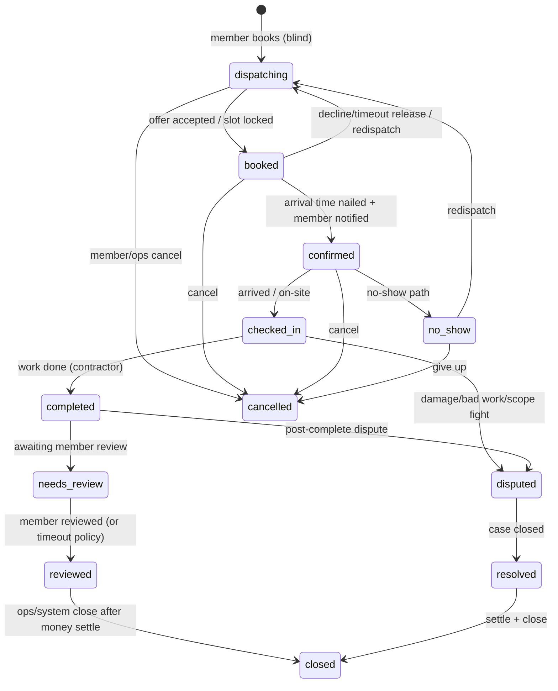

# Strech dispatch — end-to-end flow plan

Trackable plan for the full job lifecycle. Aligns the product “four flows” with Strech domain vocabulary and invariants in `AGENTS.md`.

**Done test (phase):** console watches real data through  
`dispatching → booked → confirmed → checked_in → completed → needs_review → reviewed → closed`  
(plus money rows + messy-path cases). Member app / SMS / payments processors are stubbed behind `/v1` where needed.

---

## 0. One job, one spine



**Money is not on this diagram.** `charge` / `refund` / `payout` rows join by `service_request_id`. A job can be `completed` and later `refunded` without changing status to “paid/refunded”.

### Actors on every transition

| Actor | Owns |
|-------|------|
| **member** | create request, see masked status, confirm completion, review, dispute |
| **agent** | score pool, fan-out offers, lock/release, propose arrival, parse field SMS, reminder scheduling, escalate — **only allow-listed APIs** |
| **contractor** | accept/decline offer, set/confirm arrival, otw/arrived/done, on-site exceptions |
| **ops** | exhaust-pool takeover, vetting, money auth, legal/medical/employment, ambiguous escalations |
| **system** | timers (offer TTL, reminders, review nudge), idempotent workers |

Every status change → `job_event` (audit + member timeline).

---

## 1. Flow A — Book → Dispatch

**Product intent:** Member books service type + address + window. Agent ranks vetted pool, fans out SMS offers (sequential TTL or small parallel first-accept-wins). Accept locks job; decline/timeout releases; pool exhaust → ops.

### A1. Intake (stub member app → `/v1`)

| Step | Who | API / artifact | Notes |
|------|-----|----------------|-------|
| A1.1 Create service request | member | `POST /v1/requests` | category, property, preferred window, details |
| A1.2 Land in pool | system | status `dispatching` | `job_event`; promise_by SLA clock starts |
| A1.3 INV-2 mask | API | member GET never exposes contractor | even while offers are out |

**Trackable acceptance:** request appears in ops Pool; member view shows “finding a pro” only.

### A2. Candidate scoring (agent, low-risk)

Score **vetted-only** contractors on:

1. **Skill match** — category ∩ contractor.categories  
2. **Distance / service zip** — property.zip ∈ service_zips (later: travel time)  
3. **Current load** — open booked/confirmed/checked_in count in window  
4. **Historical accept rate** — accepts / offers (rolling)  
5. (Optional later) rating, metro capacity, membership priority  

Output: ranked candidate list + recommended offer strategy (`sequential` | `parallel_batch`).

**Agent fence:** scoring + creating offers = allow-listed. Changing vetting, suspending pros, touching money = 403 → ops.

### A3. Offer fan-out

| Mode | Behavior |
|------|----------|
| **Sequential** | Offer top-1; TTL (e.g. 5–10m); on decline/timeout → next |
| **Parallel batch** | Offer top-N (e.g. 3); **first accept wins**; others auto-withdraw |

Artifacts (tables — names fixed for code):

- `dispatch_offer` — request_id, contractor_id, rank, status (`pending|accepted|declined|expired|withdrawn`), expires_at, channel (`sms` stub)  
- `dispatch_attempt` / wave id — strategy, batch size, started_at  

SMS is a **notification adapter** stubbed in API (`NotificationPort.sendOffer`). No real Twilio required for phase-1; console can Accept/Decline as contractor stand-in.

### A4. Lock / release / escalate

| Event | Status / data | Who |
|-------|---------------|-----|
| Accept | → `booked`; lock appointment slot; withdraw other offers | contractor (or agent applying contractor reply) |
| Decline / TTL | release candidate; continue wave | system / contractor |
| Pool exhaust | flag `needs_ops_dispatch`; stay `dispatching` | system → **ops only** |

**SLOT_CONFLICT** on lock → fail offer, continue or escalate (never silent).

**Trackable acceptance:** console shows offers + wave state; accept → job leaves pool as `booked` with contractor + slot; second accept on same wave fails cleanly.

---

## 2. Flow B — Dispatch → Confirmed

**Product intent:** After accept, nail exact arrival (not just window), notify member in-app, set reminder cadence T-24h / T-2h / T-30m.

### B1. Arrival solidification

| Step | Who | Notes |
|------|-----|-------|
| B1.1 Propose exact arrival within window | agent or contractor | e.g. slot 10:00–10:30 inside preferred window |
| B1.2 Contractor confirms arrival | contractor | required before `confirmed` |
| B1.3 Persist appointment | API | `appointments.slot_start/end` authoritative |

### B2. Member confirmation (blind)

| Step | Who | Notes |
|------|-----|-------|
| B2.1 Transition → `confirmed` | agent/ops/system | only after arrival locked |
| B2.2 Member notification | system | “Visit confirmed for {time}” — **no real name/photo of pro** if INV-2 still applies post-confirm per policy; use masked label (“Strech Pro”, confirmation code) |
| B2.3 confirmation_code | API | already on request; surface everywhere |

### B3. Reminder cadence

| Reminder | Audience | Channel stub |
|----------|----------|--------------|
| T-24h | member + contractor | push/SMS port |
| T-2h | member + contractor | |
| T-30m | member + contractor | |

Store `reminder_job` rows (request_id, fire_at, kind, status). System worker fires them; each fire → `job_event` note (timeline visibility).

**Trackable acceptance:** booked job can set exact slot → confirmed; reminder rows visible in console; member-facing payload has zero contractor PII leakage in tests.

---

## 3. Flow C — Confirmed → Job Complete

**Product intent:** Contractor signals otw / arrived / done (SMS or state prompt). Agent parses → timestamps → member progress. Handle messy on-site paths.

### C1. Happy path field signals

Map colloquial SMS → canonical transitions (API enforces; parser is adapter):

| Signal | Canonical | Status |
|--------|-----------|--------|
| `otw` / on my way | `en_route` event (optional substate) | stay `confirmed` + event, **or** soft flag |
| `arrived` | check-in | → `checked_in` |
| `done` | complete | → `completed` |

Prefer **explicit API actions** (`POST .../en-route`, `/check-in`, `/complete`) with SMS parser calling those. Do not let free-text alone mutate status without going through the same validators.

### C2. Member progress view (stub)

Member sees timeline from `job_event`s, masked:

- Pro confirmed  
- On the way  
- Arrived  
- Work completed  

### C3. Messy paths (first-class — not afterthoughts)

| Situation | Detection | System behavior | Escalate? |
|-----------|-----------|-----------------|-----------|
| **Running late** | contractor `late` + new ETA | event + member notify; update ETA | agent ok if ETA within policy; else ops |
| **Can't find place** | contractor flag | event; share access notes (non-medical); optional call ops | ops if access/safety |
| **Scope changed on site** | contractor `scope_change` | **do not auto-approve money**; open change-request / case | **ops** for price; agent may log only |
| **Member not home** | contractor / no-show member | → `no_show` (party=homeowner) or wait policy | agent can mark no-show if allow-listed; payout rules ops |
| **Needs a part** | `parts_hold` | stay `checked_in` (or substatus via events); schedule return visit | return visit = new request or linked follow-up |
| **Needs reschedule** | either party | unassign slot → reschedule path; may return toward `booked`/`dispatching` | agent propose; ops if dispute |
| **Contractor no-show** | timer past slot + no check-in | → `no_show` (party=contractor) → redispatch | ops if repeat offender |
| **Safety / medical / sensor alert** | Home Health Score signal | **never agent** — emergency path + ops | **hard fence** |

**Substatus pattern:** keep `ServiceRequest.status` coarse; put nuance in `job_event` + optional `job_flags` (`late`, `parts_hold`, `scope_change`) so money/status stay clean.

**Trackable acceptance:** each messy path has an API action + console button + event; agent cannot authorize scope price changes; medical path returns 403 for agent.

---

## 4. Flow D — Complete → Paid

**Product intent:** Dual confirmation, capture member card, calculate contractor payout, close job, ask for review.

### D1. Dual completion confirmation

| Step | Who | Artifact |
|------|-----|----------|
| D1.1 Contractor complete | contractor | status `completed` + summary |
| D1.2 Member confirms work OK | member | event `member_completion_ack` → `needs_review` or stay completed pending policy |
| D1.3 Dispute instead | member/ops | → `disputed` (not a refund status) |

### D2. Money (separate ledger)

| Row | Meaning |
|-----|---------|
| `charge` | what member owes (tier may make `amount_cents = 0`) |
| `payment_attempt` | card capture stub (processor port) |
| `payout` | contractor earnings calculation |
| `refund` | if case requires — **does not** set status=refunded |

Rules:

- Completion can exist before successful capture (visible failure, retry).  
- Payout calculation is deterministic from category + tier + change-orders **approved by ops**.  
- Agent **cannot** capture card, issue refund, or adjust payout — 403.

### D3. Review → close

| Step | Status |
|------|--------|
| Request review | `needs_review` + notify |
| Member submits review | `reviewed` |
| Review timeout policy | system auto-`reviewed` or ops nudge |
| Settle + close | `closed` when charge settled (or $0) and no open dispute |

**Trackable acceptance:** completed job shows charge+payout rows in console; refund can be added while status stays completed/closed; review request visible; close blocked if open dispute.

---

## 5. How the agent watches and keeps the loop moving

The agent is **not** a chat prompt with privileges. It is a **worker loop** that reads dispatch state, decides low-risk next actions, and calls the same `/v1` endpoints as ops — under an `role=agent` JWT that the API allow-lists. Timers are **system**; judgment calls are **agent**; hard fences escalate to **ops**.

### 5.1 Split of duties

| Layer | Runs | Owns |
|-------|------|------|
| **system workers** | cron / queue | Offer TTL expiry, reminder fire (T-24/T-2/T-30), no-show clock, review nudge — pure time triggers, no “judgment” |
| **agent runtime** | continuous or tick (e.g. every 15–60s) + event wakeups | Watch pool/board, score, fan-out offers, propose arrival, auto-confirm when policy says so, parse SMS → API, escalate stuck jobs |
| **ops** | human console | Exhausted pool, money, scope price, medical/legal, anything agent policy marks `escalate` |

System fires the clock; agent decides what to do when the clock (or a new event) says “something needs attention.”

### 5.2 Watch model — event + poll

Agent stays current by:

1. **Polling work queues** (API):
   - `GET /v1/agent/work` (or filtered pool/board) → jobs needing attention, grouped by reason  
     Examples: `needs_offer_wave`, `awaiting_arrival_proposal`, `ready_to_confirm`, `stale_confirmed`, `unparsed_inbound_message`, `pool_exhaust`, `sla_breach_soon`
2. **Event wakeups** (preferred when available):
   - New `job_event`, inbound SMS, offer accept/decline, timer fired → enqueue agent tick for that `service_request_id`
3. **Per-job projection**: agent reads request + offers + appointment + recent events + open flags — never invents state the DB doesn’t have

Every agent action still writes `job_event` with `actor_role=agent` so ops can see exactly what the agent did.

### 5.3 Agent confirmation settings (`agent_policy`)

“Running its own confirmation settings” = a **versioned policy row** (not prompt text) the agent loads each tick. Ops can view/edit in console; agent cannot widen its own fence.

```text
agent_policy (example fields)
─────────────────────────────
offer.strategy                 sequential | parallel_batch
offer.batch_size               3
offer.ttl_seconds              600
offer.max_waves_before_ops     3

confirm.auto_confirm           true | false
confirm.require_contractor_ack true          # arrival must be acked
confirm.max_eta_slip_minutes   30            # late ETA auto-ok under this
confirm.reminder_cadence       [24h, 2h, 30m]

field.auto_apply_sms           true          # parser → check-in/complete if unambiguous
field.ambiguous_sms            escalate      # never guess

sla.promise_by_escalate_minutes 30           # before promise_by → ops
stuck.no_progress_minutes      45            # booked/confirmed with no movement

# hard denials are NOT in this file — they live in API allow-list code
```

**Confirmation flow under policy:**

1. Offer accepted → `booked`  
2. Agent proposes exact arrival within window (or contractor sent one)  
3. If `require_contractor_ack` and contractor hasn’t acked → wait / nudge via system reminder  
4. If prerequisites met and `auto_confirm=true` → agent calls `POST /requests/{id}/confirm`  
5. If `auto_confirm=false` or confidence/prereqs fail → leave on ops Board as `ready_to_confirm`  
6. System schedules reminder rows from `reminder_cadence` (agent requests schedule; system fires)

Agent does **not** invent reminder times per chat turn — it applies policy, then system owns delivery.

### 5.4 Keep-moving loop (one tick)

```text
for job in agent_work_queue:
  if medical_or_money_or_legal(job): escalate_ops; continue
  match job.attention_reason:
    needs_offer_wave      → score; create offers per policy
    offer_expired         → next wave or escalate if max_waves
    awaiting_arrival      → propose slot; nudge contractor
    ready_to_confirm      → confirm if policy.auto_confirm else escalate
    inbound_sms           → parse; if unambiguous apply API else escalate
    late_under_threshold  → update ETA + notify member
    late_over_threshold   → escalate ops
    stuck / sla_breach    → escalate ops
    else                  → no-op (system timers still run)
```

If the API returns **403**, agent must escalate — it never retries a denied action with a different story.

### 5.5 What ops sees

- **Agent activity** on the request timeline (`actor_role=agent`)  
- **Policy panel** — current confirmation/offer/SLA settings  
- **Escalation queue** — jobs the agent refused or could not advance  
- Toggle `auto_confirm` off → agent still watches and prepares; humans press Confirm  

---

## 6. Agent fence (API allow-list sketch)

**Allow (low-risk):**

- Read pool / agent work queue, score candidates, create/cancel offers  
- Apply accept/decline from contractor channel  
- Propose arrival time; trigger confirm **when policy + state machine allow**  
- Request reminder schedule (system fires)  
- Parse field signals into en-route / check-in / complete **when unambiguous + state allows**  
- Flag late / can’t-find / parts_hold (logging)  
- Escalate to ops queue  
- Read `agent_policy` (write policy = **ops only**)  

**Deny (403 → human):**

- Vetting approve/suspend, employment decisions  
- Money: capture, refund, payout override, tip disputes  
- Scope/price change approval  
- Legal / damage / injury cases  
- Home Health Score / medical / emergency  
- Blind-booking bypass (any member payload with real contractor identity)  
- Widening its own allow-list or policy past ops-set bounds  
- Anything ambiguous → deny/escalate  

---

## 7. Console surfaces (thin, trackable)

| Console view | Shows |
|--------------|-------|
| **Pool** | `dispatching` + promise_by + active wave |
| **Offer radar** (new) | pending offers, TTLs, accepts/declines |
| **Agent** (new) | work queue, last tick, policy (`auto_confirm`, offer TTL, SLA), escalations |
| **Board** | columns by status |
| **Request desk** | events timeline, flags, actions, money panel |
| **Reminders** | upcoming T-24/T-2/T-30 |
| **Cases** | disputed / no_show / scope_change needing ops |
| **Field** | contractor jobs + otw/arrived/done buttons (SMS stand-in) |
| **Contractors** | vetting, availability |

---

## 8. Work packages (build order — trackable)

Use these as tickets. Each has a crisp acceptance. Prefer API-first; console follows same package.

### WP0 — Foundations
- [ ] Schema spine: requests, properties, contractors (vetted), appointments, job_events  
- [ ] Actor JWT roles + edge bearer  
- [ ] Status transition engine (central) — illegal transitions 409  
- [ ] Every transition writes `job_event`  
- [ ] INV-2 member serializer tests  

### WP1 — Book → pool
- [ ] `POST /requests` → `dispatching`  
- [ ] Pool list for ops/agent  
- [ ] Console Pool  

### WP2 — Scoring + offers
- [ ] Ranked candidates endpoint (skill, zip, load, accept rate)  
- [ ] `dispatch_offer` + sequential + parallel_batch strategies  
- [ ] Offer TTL worker  
- [ ] Accept → `booked` + slot lock; withdraw siblings  
- [ ] Pool exhaust → ops escalation queue  
- [ ] Console Offer radar + accept/decline stand-in  

### WP3 — Confirm + reminders
- [ ] Exact arrival set + → `confirmed`  
- [ ] Masked member confirmation stub  
- [ ] Reminder rows + worker (T-24/T-2/T-30)  
- [ ] Console reminders on request desk  
- [ ] `agent_policy` row + ops edit; agent auto-confirm path  

### WP3b — Agent runtime (watch loop)
- [ ] `GET /v1/agent/work` attention queue  
- [ ] Agent tick worker (poll + event wakeup)  
- [ ] Apply policy: offer waves, auto-confirm, escalate stuck/SLA  
- [ ] All agent actions as `job_event` with `actor_role=agent`  
- [ ] Console Agent panel (queue + policy toggles)  
- [ ] 403 on policy self-widen / money / medical  

### WP4 — Field loop
- [ ] en-route / check-in / complete APIs  
- [ ] Field console buttons  
- [ ] SMS parser adapter stub → same APIs  
- [ ] Member timeline projection from events  

### WP5 — Messy paths
- [ ] late + ETA  
- [ ] cant_find  
- [ ] scope_change → ops case (no auto money)  
- [ ] member/contractor no_show + redispatch  
- [ ] parts_hold + follow-up link  
- [ ] reschedule / reassign  
- [ ] agent 403 tests on medical + money + scope approve  

### WP6 — Money + review + close
- [ ] charge / payout / refund tables (no status pollution)  
- [ ] payment capture stub + failure retry  
- [ ] dual confirm + needs_review → reviewed  
- [ ] close guards (dispute open? unsettled charge?)  
- [ ] Console money + case panels  

### WP7 — Hardening
- [ ] Idempotency keys on all writes  
- [ ] SLOT_CONFLICT correctness  
- [ ] Audit export of job_events  
- [ ] Smoke: full happy path + one messy path + one money path  

---

## 9. Mapping your four flows → WPs

| Product flow | Primary WPs | Happy path statuses |
|--------------|-------------|---------------------|
| Book → Dispatch | WP1, WP2 | → `dispatching` → `booked` |
| Dispatch → Confirmed | WP3 | → `confirmed` |
| Confirmed → Job Complete | WP4, WP5 | → `checked_in` → `completed` |
| Complete → Paid | WP6 | money rows + → `needs_review` → `reviewed` → `closed` |

---

## 10. Explicit non-goals (this phase)

- Real Twilio/Stripe (ports + stubs only)  
- Member consumer app / Bobo 3D UI  
- Full geo routing ML  
- Production IdP  

Stub the ports; keep the state machine and audit trail real.

---

## 12. Holes — unresolved decisions & missing machinery

These are the gaps. Do not paper over them in code; decide or ticket explicitly.

### H1 — Status vocabulary drift (blocking)
Plan uses `booked` / `checked_in`. Legacy console/API smoke used `scheduled` / `assigned` / `in_progress`. **One canonical enum must win** before WP0. Every client and transition table depends on it.

### H2 — When does the appointment row exist?
Accept → `booked` locks a slot, but B1 still “proposes exact arrival.” Unclear whether:
- (a) accept locks a **provisional** window and confirm writes final `appointments` row, or  
- (b) accept already writes `appointments` and confirm only flips status + notifies.  
Race rules (SLOT_CONFLICT, withdraw siblings) differ. **Decide in WP2.**

### H3 — INV-2 after confirmation (policy undecided)
Domain says mask before *and per policy after* confirm. Plan hedges. Need a hard rule:
- member never sees legal name/photo/phone, **or**
- after `confirmed`, member sees limited identity for safety (name + photo + ETA).  
Serializer tests cannot be written until this is fixed.

### H4 — “Confirm” means three different things
Overloaded word:
1. Contractor acks exact arrival  
2. Agent/ops flips status → `confirmed` + member notify  
3. Member “confirms work OK” after complete  
Name them apart in API (`ack_arrival`, `confirm_visit`, `ack_completion`) or ops will mis-wire buttons.

### H5 — Charge lifecycle timing
When is `charge` created? At book, at confirm, or at complete?  
When is card captured relative to contractor `complete` and member ack?  
What if capture fails but work is done? (plan says retry — no aging, no ops SLA, no “comp the visit” path.)  
Membership tier → $0 included visit rules not specified beyond a sentence.

### H6 — Payout vs close ordering
Can `closed` happen before payout row is `paid`/`scheduled`?  
What if dispute opens after capture but before payout? Hold? Clawback?  
Agent denied — but **ops playbook** for money states is missing.

### H7 — Dual-confirm vs `needs_review` sequence
D1 says member ack → `needs_review` *or* stay completed. That’s two products. Pick one state machine:
- `completed` → (member ack | timeout) → `needs_review` → `reviewed` → `closed`, or  
- `completed` → `needs_review` automatically, review is the member act.  

### H8 — Case model is underspecified
`disputed` / `resolved`, change-requests, scope_change flags, escalation queue — four overlapping concepts. Need one **case** entity (or explicit mapping) with owner, reason codes, money impact, and which statuses it may attach to.

### H9 — Emergency / Home Health Score ingress
Invariant says medical never hits the agent — but there is **no intake path**: webhook? sensor service? ops panic button?  
Without an ingress + `emergency` case type that bypasses agent work queue, the fence is theoretical.

### H10 — Offer race & capacity truth
Parallel first-accept-wins needs DB-level exclusivity (transaction / row lock / unique partial index).  
Availability model is fuzzy: recurring windows vs concrete slots vs soft “load count.”  
Empty candidate set at intake (no vetted pro in zip) — fail at book vs sit in pool forever?

### H11 — SMS identity & threading
How does an inbound text map to `(contractor_id, service_request_id)`?  
One phone, many jobs? Wrong-job apply risk.  
Parser confidence threshold undefined (“unambiguous” is not a spec).  
Failed send / carrier delay vs offer TTL = silent miss.

### H12 — Agent runtime hosting
Where does the tick process live? Inside `strech-dispatch-api` workers? Separate `strech-dispatch-agent` service?  
Who mints `role=agent` JWTs in prod?  
Idempotency if two ticks run on the same job.  
**No repo for dispatch-api in this workspace** — greenfield hole for the source of truth itself.

### H13 — Ops + agent double-driving
Can ops manually book while agent is mid-wave?  
Need lock: `dispatch_owner = agent|ops`, or cancel open offers on ops takeover.  
Otherwise duplicate assigns / SLOT_CONFLICT storms.

### H14 — Follow-up / parts / multi-day work
`parts_hold` → “new request or linked follow-up” — undecided.  
Same contractor obligated? New offer wave? Money on which `service_request_id`?  
Partial complete (fixed A, deferred B) not modeled.

### H15 — Cancellation & money
Who can cancel in which statuses; refund vs void vs no charge; contractor kill-fee — unset.  
Member cancel after `confirmed` is the common trust case — no policy.

### H16 — Reminder edge cases
Timezone of property vs contractor.  
Reschedule must **cancel/rewrite** reminder rows (not said).  
Job cancelled after T-24h already sent — no retraction story.

### H17 — Access / elderly / PII in `details`
Gate codes, lockboxes, “member has dementia,” pets — needed on site, dangerous in SMS and in agent context.  
No redaction tiers (ops-only vs contractor-visible vs member timeline).

### H18 — Contractor fitness over time
Vetting approved once; what about insurance expiry, suspend mid-offer-wave, rating collapse?  
Assignable query must re-check fitness at **accept time**, not only at score time (mentioned loosely via vetted-only, not expiry).

### H19 — SLA `promise_by`
Set how? Tier-based? Category-based?  
Breach → escalate only, or auto-comp, or cancel? Unspecified.

### H20 — Console “done test” vs product four flows
Done test is desk-driven loop. Product flows assume agent + SMS + card capture.  
Without stubs that **look real in console** (offer accept, fake SMS inbound, fake payment_attempt), holes H5/H11 stay invisible until late.

### H21 — Legacy console mismatch
Current `strech-ops-console` has no Offer radar, Agent panel, money panel, cases, or `booked`/`checked_in` gates. Rebuild vs patch is undecided under “start fresh.”

### Priority to close first (before coding past WP2)
1. **H1** status enum  
2. **H2** appointment timing  
3. **H3** INV-2 post-confirm  
4. **H13** ops vs agent ownership  
5. **H12** where dispatch-api + agent worker live  
6. **H5/H7** money + review state order  

---

## 11. Suggested next step

Implement **WP0 → WP1 → WP2** until Offer radar can lock a job from the pool in the console. That is the first vertical slice of Flow A and unblocks everything else.
